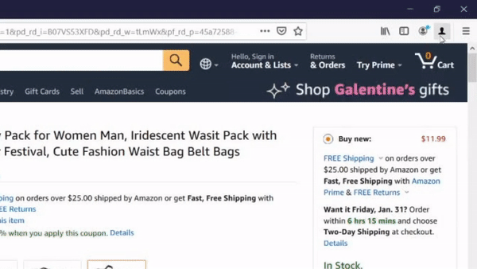

# Comparer WebExtension

## Running locally

Install web-ext
```
npm install -g web-ext
```

Install dogescript
```
npm install -g dogescript
```

Run the extension
```
cd src && make && web-ext run
```

## Versions

### Version 1: Hello World

